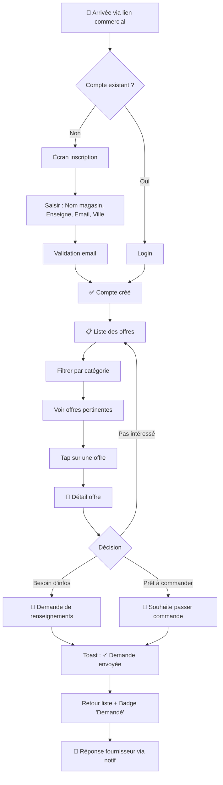
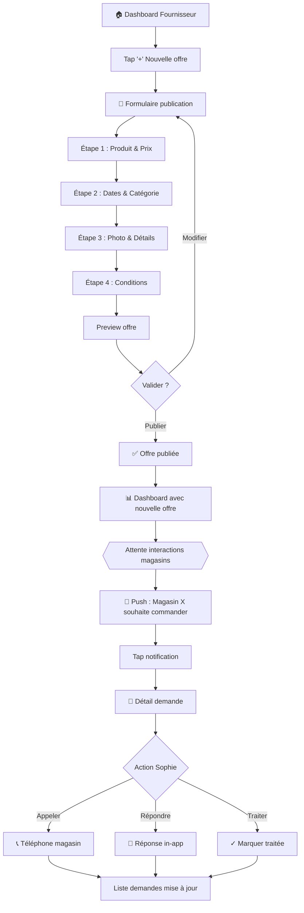
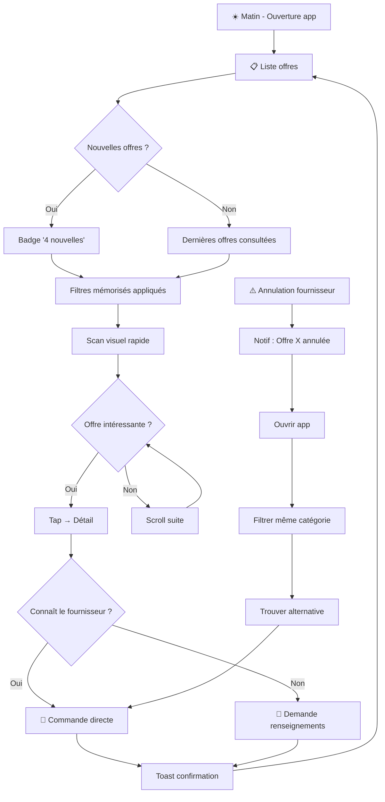
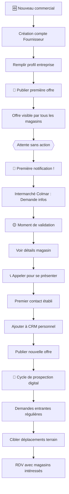

# UX Design Specification - aurelien-project

**Author:** Youssef
**Date:** 2026-02-03

---

## Executive Summary

### Project Vision

**aurelien-project** est une marketplace B2B PWA qui connecte les fournisseurs de la grande distribution avec les chefs de rayon des enseignes indépendantes (Leclerc, Intermarché, Super U, Système U) pour les promotions hors catalogue.

La proposition de valeur UX : transformer une relation commerciale fragmentée (mails ignorés, RDV annulés, informations éparpillées) en une expérience fluide où le chef de rayon découvre, compare et commande en autonomie — et où le commercial gagne en visibilité et en couverture terrain.

### Target Users

#### Persona Principal : Julien — Chef de rayon
- **Contexte** : 34 ans, Leclerc Grand Est, 8 ans d'expérience, équipe en sous-effectif
- **Environnement d'usage** : Mobile/tablette, devant l'allée centrale, connexion instable
- **Motivation principale** : Gagner du temps, ne pas rajouter de charge de travail
- **Comportement clé** : Consulte les offres le matin, décide vite, veut comparer marge/CA
- **Critère de succès UX** : "Je commande plus facilement, moins de temps en RDV"

#### Persona Secondaire : Sophie — Commerciale terrain
- **Contexte** : 42 ans, PME agroalimentaire, 180 magasins, 40 000 km/an
- **Environnement d'usage** : Mobile en déplacement, bureau pour publication
- **Motivation principale** : Couvrir tout son parc, visibilité sur l'engagement
- **Comportement clé** : Publie ses promos, suit les notifications, cible ses déplacements
- **Critère de succès UX** : "Mes RDV sont plus qualitatifs, je touche des magasins que je ne voyais jamais"

### Key Design Challenges

| Défi | Impact UX | Stratégie |
|------|-----------|-----------|
| **Temps sacré** | Chaque seconde compte pour Julien | Chargement < 2s, interactions 2-3 clics max |
| **Usage terrain mobile** | Connexion instable, écran petit, une main occupée | Interface légère, touch-friendly, feedback offline |
| **Double population** | Fournisseur vs Magasin = besoins opposés | Deux expériences distinctes, navigation claire |
| **Adoption sans formation** | Aucune patience pour apprendre | Évidence immédiate, patterns familiers |
| **Crainte du remplacement** | Sophie doit sentir sa valeur augmentée | Feedback valorisant, insights exclusifs |

### Design Opportunities

| Opportunité | Avantage compétitif |
|-------------|---------------------|
| **Réflexe matinal** | Devenir le premier geste de Julien → rétention maximale |
| **Comparaison visuelle** | Là où Excel échoue : 3 offres côte à côte, décision en un coup d'œil |
| **Gratification instantanée** | Notifications temps réel pour Sophie → engagement émotionnel |
| **Simplicité radicale** | Moins mais mieux → différenciateur vs outils enterprise complexes |

## Core User Experience

### Defining Experience

**Action Core Magasin (Julien) :**
Découvrir → Comparer → Décider en moins de 2 minutes. Le loop quotidien : ouvrir l'app le matin, voir les nouvelles offres, comparer sur marge/CA, cliquer "Souhaite passer commande".

**Action Core Fournisseur (Sophie) :**
Publier → Être notifiée → Cibler. Publier une offre, recevoir la notification d'intérêt, savoir exactement où concentrer son énergie terrain.

### Platform Strategy

| Aspect | Décision | Justification |
|--------|----------|---------------|
| **Format** | PWA (Progressive Web App) | Pas d'installation, compatible tous supports, un seul développement |
| **Device primaire** | Mobile | Usage terrain (Julien en rayon, Sophie en déplacement) |
| **Devices secondaires** | Tablette, PC, boîtiers magasin | Flexibilité selon contexte |
| **Interaction primaire** | Touch-first | Julien en rayon avec une main occupée |
| **Interaction secondaire** | Clavier | Sophie au bureau pour publication |
| **Offline** | Post-MVP | À évaluer si connexion instable confirmée comme problème réel |

### Effortless Interactions

| Interaction | Criticité | Design Intent |
|-------------|-----------|---------------|
| **Voir les nouvelles offres** | Haute | Feed personnalisé, badge "Nouveau", zéro clic requis |
| **Filtrer par catégorie** | Haute | Filtre mémorisé, activation en un tap |
| **Comparer 2-3 offres** | Critique | Vue side-by-side, chiffres clés en évidence |
| **Envoyer une demande** | Critique | 1 bouton, pas de formulaire, confirmation instantanée |
| **Publier une offre** | Haute | Formulaire intelligent, photo en 1 tap, auto-save brouillon |

### Critical Success Moments

| Moment | Description | Critère de succès |
|--------|-------------|-------------------|
| **Premier lancement** | Julien voit des offres pertinentes immédiatement | Pas d'écran vide, contenu personnalisé |
| **Première demande** | Feedback instantané après clic | Confirmation visuelle claire et immédiate |
| **Première notification** | Sophie reçoit "Magasin X souhaite commander" | Moment de gratification, création d'habitude |
| **Comparaison rapide** | Décision entre 3 offres | < 30 secondes, plus rapide qu'Excel |
| **Retour J+1** | Julien revient de lui-même | Rétention organique sans relance |

### Experience Principles

| # | Principe | Application concrète |
|---|----------|---------------------|
| **1** | **Speed is respect** | < 2s chargement, < 500ms interactions. Le temps de l'utilisateur est sacré. |
| **2** | **One hand, one glance** | Interface utilisable d'une main, décision possible en un coup d'œil. |
| **3** | **Notification = Reward** | Chaque notification apporte de la valeur et génère de la satisfaction. |
| **4** | **Zero learning curve** | Évidence immédiate. Si tu dois expliquer, c'est raté. |
| **5** | **Less is more** | Chaque écran fait UNE chose bien. Pas de complexité inutile. |

## Desired Emotional Response

### Primary Emotional Goals

| Persona | Émotion primaire | Description |
|---------|------------------|-------------|
| **Julien (Magasin)** | **Sérénité & Contrôle** | "Tout est là, je maîtrise ma zone promo sans stress" |
| **Sophie (Fournisseur)** | **Valorisation & Excitation** | "Mon travail est visible, et les magasins répondent" |

### Emotional Journey Mapping

#### Julien — Chef de rayon

| Phase | Émotion | Trigger UX |
|-------|---------|------------|
| Ouverture app | Sérénité | Interface épurée, offres organisées |
| Découverte offres | Curiosité satisfaite | Badge "Nouveau", contenu pertinent |
| Comparaison | Confiance | Chiffres clairs, vue side-by-side |
| Envoi demande | Accomplissement | Feedback instantané "✓ Envoyé" |
| Retour J+1 | Habitude positive | État mémorisé, nouvelles offres visibles |

#### Sophie — Commerciale terrain

| Phase | Émotion | Trigger UX |
|-------|---------|------------|
| Publication offre | Fierté | Confirmation visuelle, offre live |
| Réception notification | Excitation | Son subtil, badge, animation |
| Vue des demandes | Empowerment | Liste claire, infos magasin complètes |
| Fin de journée | Satisfaction | Récap des interactions reçues |

### Micro-Emotions

| À cultiver | À éviter | Levier UX |
|------------|----------|-----------|
| **Confiance** | Doute | Feedback clair à chaque action |
| **Contrôle** | Submersion | Une tâche par écran, interface épurée |
| **Compétence** | Incompétence | Patterns familiers, zéro learning curve |
| **Reconnaissance** | Invisibilité | Métriques d'engagement visibles (Sophie) |
| **Calme** | Stress | Pas d'urgence artificielle |

### Design Implications

| Émotion cible | Choix UX |
|---------------|----------|
| **Sérénité** | Whitespace généreux, minimalisme, pas de clutter |
| **Confiance** | Chiffres explicites (marge %, remise %), vocabulaire métier |
| **Accomplissement** | Micro-animations de succès, confirmation visuelle immédiate |
| **Excitation** | Notification avec feedback sensoriel (son, badge, animation) |
| **Contrôle** | Filtres persistants, état mémorisé, navigation prévisible |

### Emotional Design Principles

| # | Principe | Application |
|---|----------|-------------|
| **1** | **Clarity breeds confidence** | Chaque élément doit être immédiatement compréhensible |
| **2** | **Feedback is validation** | Toute action utilisateur reçoit une réponse visible |
| **3** | **Calm over urgency** | Pas de stress artificiel, l'utilisateur contrôle son rythme |
| **4** | **Recognition matters** | Sophie doit voir l'impact concret de son travail |
| **5** | **Delight in details** | Micro-interactions qui transforment l'utile en agréable |

## UX Pattern Analysis & Inspiration

### Inspiring Products Analysis

| Produit | Forces UX | Patterns clés |
|---------|-----------|---------------|
| **Leboncoin Pro** | Publication ultra-simple, cards claires | Formulaire en étapes, photo 1 tap, brouillon auto |
| **Slack** | Notifications engageantes, état lu/non lu | Badge + son, temps réel, preview |
| **Notion** | Whitespace, minimalisme, typographie | Respiration visuelle, hiérarchie claire |
| **Uber Eats** | Comparaison rapide, filtres efficaces | Cards produit, chips horizontaux, scroll compare |
| **WhatsApp Business** | Adoption massive, mobile-first | Patterns familiers, performance, touch-friendly |

### Transferable UX Patterns

#### Navigation
| Pattern | Application aurelien-project |
|---------|------------------------------|
| Bottom nav bar | Magasin : Offres / Mes demandes / Profil |
| Tabs horizontaux | Fournisseur : Mes offres / Demandes / Stats |
| Pull-to-refresh | Actualisation liste offres |

#### Interaction
| Pattern | Application aurelien-project |
|---------|------------------------------|
| Swipe actions | Swipe offre → Demande rapide |
| Floating Action Button | "+" créer offre (Sophie) |
| Skeleton loading | Feedback pendant chargement |
| Haptic feedback | Vibration sur "Demande envoyée" |

#### Visuel
| Pattern | Application aurelien-project |
|---------|------------------------------|
| Card-based layout | 1 offre = 1 card (photo + infos) |
| Badge "Nouveau" | Indicateur offres fraîches |
| Progress indicator | Étapes publication offre |
| Empty state illustré | Écran "Aucune offre" engageant |

### Anti-Patterns to Avoid

| Anti-pattern | Raison d'exclusion |
|--------------|-------------------|
| Menu hamburger caché | Julien ne cherchera pas |
| Formulaires interminables | Sophie abandonne |
| Notifications spam | Désactivation immédiate |
| Infinite scroll sans repère | Perte de contexte |
| Modals bloquants | Frustration mobile |
| Jargon technique | Confusion utilisateur |
| Confirmation excessive | Friction inutile |

### Design Inspiration Strategy

#### Adopter directement
- Bottom navigation (standard mobile familier)
- Cards avec photo + prix (prouvé efficace)
- Badge notifications (référence engagement)
- Pull-to-refresh (geste universel)

#### Adapter
- Filtres Uber Eats → 4 filtres max (catégorie, date, fournisseur, enseigne)
- Publication Leboncoin → Ajouter champs métier sans alourdir
- Notifications Slack → Contexte B2B (moins fréquent, plus ciblé)

#### Éviter absolument
- Onboarding tutorial (l'app doit être évidente)
- Features cachées (tout visible)
- Refresh manuel obligatoire (temps réel)
- Compte requis pour voir (voir d'abord, s'inscrire après)

## Design System Foundation

### Design System Choice

**Système retenu :** shadcn/ui + Tailwind CSS

| Aspect | Décision |
|--------|----------|
| **Base composants** | shadcn/ui (composants Radix UI stylisés) |
| **Framework CSS** | Tailwind CSS (utility-first) |
| **Approche** | Composants copiés dans le projet (pas de dépendance npm) |
| **Accessibilité** | Radix UI primitives (ARIA intégré) |

### Rationale for Selection

| Critère | Pourquoi shadcn/ui |
|---------|-------------------|
| **Performance** | Pas de runtime CSS, bundle optimisé, tree-shaking natif |
| **Vitesse de dev** | Composants prêts, copier-coller, iteration rapide |
| **Personnalisation** | CSS variables, modification directe du code source |
| **Minimalisme** | Esthétique épurée alignée avec "Less is more" |
| **Maintenance** | Code dans le projet = contrôle total, pas de breaking changes externes |
| **Mobile-first** | Tailwind responsive par défaut, classes sm/md/lg |

### Implementation Approach

#### Stack technique recommandé
| Couche | Technologie |
|--------|-------------|
| **Framework** | Next.js 14+ (App Router) |
| **UI Components** | shadcn/ui |
| **Styling** | Tailwind CSS |
| **Icons** | Lucide React |
| **Animations** | Framer Motion (micro-interactions) |

#### Composants shadcn/ui à utiliser
| Composant | Usage aurelien-project |
|-----------|------------------------|
| `Card` | Affichage des offres promotionnelles |
| `Button` | Actions principales (Demande, Commander) |
| `Input` / `Textarea` | Formulaires publication offre |
| `Badge` | Indicateurs "Nouveau", statuts |
| `Tabs` | Navigation Fournisseur |
| `Sheet` | Panels mobile (filtres, détails) |
| `Toast` | Notifications feedback actions |
| `Skeleton` | Loading states |
| `Dialog` | Confirmations (si nécessaire) |

### Customization Strategy

#### Design Tokens (CSS Variables)
| Token | Usage |
|-------|-------|
| `--primary` | Couleur marque principale |
| `--primary-foreground` | Texte sur fond primary |
| `--success` | Vert confirmation |
| `--warning` | Orange attention |
| `--destructive` | Rouge erreur |
| `--background` | Fond principal |
| `--foreground` | Texte principal |
| `--muted` | Texte secondaire |
| `--border` | Bordures |

#### Adaptations spécifiques
| Besoin | Customisation |
|--------|---------------|
| **Touch targets** | Minimum 44x44px sur mobile |
| **Cards offres** | Composant custom basé sur Card |
| **Bottom nav** | Composant custom (non inclus dans shadcn) |
| **Filtres chips** | Adaptation du composant Badge/Toggle |

#### Principes de personnalisation
1. Partir des composants shadcn avant de créer du custom
2. Étendre via Tailwind plutôt que CSS custom
3. Documenter les variations pour cohérence
4. Tester sur mobile en priorité (touch, tailles)

## Defining User Experience

### Defining Experience Statement

**Julien (Magasin) :** "Voir une offre → Commander en 2 taps"
- Le moment magique : réaliser que c'est TELLEMENT plus simple qu'attendre un RDV commercial
- Temps total : < 10 secondes du lancement à la demande envoyée

**Sophie (Fournisseur) :** "Notification → Un magasin veut commander"
- Le moment magique : toucher un magasin qu'elle n'aurait jamais visité
- Feedback instantané sur l'engagement de son parc client

### User Mental Model

#### Julien — Transformation du modèle mental
| Avant (subi) | Après (contrôle) |
|--------------|------------------|
| "Je dois recevoir 5 commerciaux cette semaine" | "Je consulte les offres quand JE veux" |
| "J'ai des mails que j'ai pas lu" | "Tout est au même endroit, filtré" |
| "Je compare de mémoire" | "Je vois marge + CA côte à côte" |
| "Je dois rappeler le commercial" | "1 tap et c'est fait" |

#### Sophie — Transformation du modèle mental
| Avant (frustration) | Après (empowerment) |
|---------------------|---------------------|
| "J'envoie des mails sans savoir si c'est lu" | "Je vois qui est intéressé" |
| "30% de mes RDV sont annulés" | "Je vais voir ceux qui ont montré de l'intérêt" |
| "Je couvre 20% de mon parc" | "L'app touche les 80% que je ne vois jamais" |

### Success Criteria

#### "Commander en 2 taps" (Julien)
| Critère | Mesure |
|---------|--------|
| **Rapidité** | < 10 secondes du lancement à la demande envoyée |
| **Évidence** | Zéro hésitation, bouton visible immédiatement |
| **Feedback** | Confirmation instantanée "✓ Envoyé", pas de doute |
| **Réversibilité** | Pouvoir annuler si erreur (rassure) |

#### "Notification magique" (Sophie)
| Critère | Mesure |
|---------|--------|
| **Pertinence** | Chaque notification = une vraie opportunité commerciale |
| **Clarté** | En 1 ligne : qui + quoi + où |
| **Actionnable** | Tap → toutes les infos pour agir |
| **Non-intrusif** | Pas de spam, que du signal |

### Pattern Analysis

| Aspect | Type | Justification |
|--------|------|---------------|
| **Navigation** | Établi | Bottom nav, tabs = patterns universels |
| **Cards offres** | Établi | Leboncoin, Uber Eats = références prouvées |
| **Filtres** | Établi | Chips horizontaux universels |
| **"Commander en 2 taps"** | Innovation simple | Friction zéro, pas de formulaire |
| **Notifications B2B** | Adaptation | Slack-like en contexte commercial |

**Stratégie :** 90% patterns établis + 10% innovation clé (friction zéro pour exprimer l'intérêt)

### Experience Mechanics

#### Flow "Commander en 2 taps" (Julien)

| Étape | Écran | Action utilisateur | Feedback système |
|-------|-------|-------------------|------------------|
| 1 | Liste offres | Scroll, scan visuel | Cards avec badge "Nouveau" |
| 2 | Liste offres | Tap sur card | Transition vers détail |
| 3 | Détail offre | Lecture infos (photo, prix, marge, dates) | - |
| 4 | Détail offre | Tap "Souhaite commander" | Haptic + animation bouton |
| 5 | Toast | - | "✓ Demande envoyée à [Fournisseur]" |
| 6 | Liste offres | Retour auto | Badge "Demandé" sur la card |

#### Flow "Notification magique" (Sophie)

| Étape | Écran | Contenu | Action possible |
|-------|-------|---------|-----------------|
| 1 | Push notification | "🛒 Leclerc Strasbourg souhaite commander" | Tap pour ouvrir |
| 2 | Détail demande | Infos magasin + offre concernée + type demande | - |
| 3 | Détail demande | - | [📞 Appeler] [💬 Répondre] [✓ Traiter] |

#### États de la card offre (Julien)
| État | Visuel | Signification |
|------|--------|---------------|
| **Nouveau** | Badge vert "Nouveau" | Offre jamais vue |
| **Vu** | Pas de badge | Offre consultée |
| **Demandé** | Badge bleu "Demandé" | Demande envoyée |
| **Expiré** | Grisé + "Expiré" | Dates dépassées |

## Visual Design Foundation

### Color System

#### Palette principale — Slate Monochrome

| Token | Couleur | Hex | Usage |
|-------|---------|-----|-------|
| `--primary` | Slate 900 | `#0F172A` | Boutons principaux, texte important |
| `--primary-foreground` | White | `#FFFFFF` | Texte sur fond primary |
| `--secondary` | Slate 100 | `#F1F5F9` | Boutons secondaires, fonds alternatifs |
| `--secondary-foreground` | Slate 900 | `#0F172A` | Texte sur fond secondary |
| `--accent` | Slate 600 | `#475569` | Éléments interactifs hover |
| `--accent-foreground` | White | `#FFFFFF` | Texte sur accent |

#### Couleurs sémantiques

| Token | Couleur | Hex | Usage |
|-------|---------|-----|-------|
| `--success` | Emerald 600 | `#059669` | Confirmations, validations, "✓ Envoyé" |
| `--success-foreground` | White | `#FFFFFF` | Texte sur success |
| `--warning` | Amber 600 | `#D97706` | Alertes, dates proches expiration |
| `--warning-foreground` | White | `#FFFFFF` | Texte sur warning |
| `--destructive` | Rose 600 | `#E11D48` | Erreurs, suppressions |
| `--destructive-foreground` | White | `#FFFFFF` | Texte sur destructive |

#### Couleurs de surface

| Token | Couleur | Hex | Usage |
|-------|---------|-----|-------|
| `--background` | White | `#FFFFFF` | Fond principal app |
| `--foreground` | Slate 900 | `#0F172A` | Texte principal |
| `--card` | White | `#FFFFFF` | Fond cards |
| `--card-foreground` | Slate 900 | `#0F172A` | Texte cards |
| `--muted` | Slate 100 | `#F1F5F9` | Fonds désactivés, sections |
| `--muted-foreground` | Slate 500 | `#64748B` | Texte secondaire, placeholders |
| `--border` | Slate 200 | `#E2E8F0` | Bordures, séparateurs |
| `--input` | Slate 200 | `#E2E8F0` | Bordures champs de saisie |
| `--ring` | Slate 400 | `#94A3B8` | Focus ring accessibilité |

#### Principe de coloration
- **Le contenu apporte la couleur** : les photos produits sont les éléments colorés
- **Interface neutre** : ne pas rivaliser avec le contenu
- **Couleurs sémantiques uniquement** : success/warning/error pour les états

### Typography System

#### Police principale

| Aspect | Valeur |
|--------|--------|
| **Font family** | Inter (Variable) |
| **Fallback** | system-ui, -apple-system, sans-serif |
| **Source** | Google Fonts / Bunny Fonts |

#### Échelle typographique

| Token | Taille | Line Height | Weight | Usage |
|-------|--------|-------------|--------|-------|
| `text-xs` | 12px | 16px | 400 | Badges, labels, metadata |
| `text-sm` | 14px | 20px | 400 | Texte secondaire, descriptions |
| `text-base` | 16px | 24px | 400 | Corps de texte, contenu principal |
| `text-lg` | 18px | 28px | 500 | Titres cards, sous-titres |
| `text-xl` | 20px | 28px | 600 | Titres sections |
| `text-2xl` | 24px | 32px | 600 | Titres écrans |
| `text-3xl` | 30px | 36px | 700 | Headers principaux (rare) |

#### Weights utilisés

| Weight | Token | Usage |
|--------|-------|-------|
| 400 | `font-normal` | Corps de texte |
| 500 | `font-medium` | Labels, emphasis légère |
| 600 | `font-semibold` | Titres, boutons |
| 700 | `font-bold` | Headers (usage rare) |

#### Chiffres

| Feature | Configuration |
|---------|---------------|
| **Tabular nums** | Activé pour prix, pourcentages, marge |
| **Alignement** | Chiffres alignés verticalement dans les listes |

### Spacing & Layout Foundation

#### Système d'espacement (base 4px)

| Token | Valeur | Usage |
|-------|--------|-------|
| `space-0.5` | 2px | Micro-ajustements |
| `space-1` | 4px | Entre icône et label |
| `space-2` | 8px | Padding interne compact |
| `space-3` | 12px | Gap entre éléments liés |
| `space-4` | 16px | Padding standard, marges mobile |
| `space-5` | 20px | Padding cards |
| `space-6` | 24px | Entre groupes d'éléments |
| `space-8` | 32px | Entre sections |
| `space-10` | 40px | Marges larges |
| `space-12` | 48px | Espacement sections majeures |

#### Layout principles

| Principe | Application |
|----------|-------------|
| **Mobile-first** | Design pour 375px, scale up |
| **Safe areas** | Padding horizontal 16px minimum |
| **Touch targets** | Minimum 44x44px cliquable |
| **Whitespace** | Généreux, respiration visuelle |
| **Card radius** | 12px (border-radius-lg) |
| **Button radius** | 8px (border-radius-md) |
| **Input radius** | 8px (border-radius-md) |

#### Shadows

| Token | Valeur | Usage |
|-------|--------|-------|
| `shadow-sm` | 0 1px 2px rgba(0,0,0,0.05) | Subtle elevation |
| `shadow` | 0 1px 3px rgba(0,0,0,0.1) | Cards au repos |
| `shadow-md` | 0 4px 6px rgba(0,0,0,0.1) | Cards hover, modals |
| `shadow-lg` | 0 10px 15px rgba(0,0,0,0.1) | Dropdowns, popovers |

#### Grid system

| Breakpoint | Colonnes | Container max | Usage |
|------------|----------|---------------|-------|
| `sm` (640px) | 1 | 100% | Mobile |
| `md` (768px) | 2 | 100% | Tablet portrait |
| `lg` (1024px) | 3 | 1024px | Tablet landscape |
| `xl` (1280px) | 4 | 1280px | Desktop |

### Accessibility Considerations

#### Contraste

| Combinaison | Ratio | Status |
|-------------|-------|--------|
| Slate 900 sur White | 15.4:1 | AAA |
| Slate 500 sur White | 4.6:1 | AA |
| White sur Slate 900 | 15.4:1 | AAA |
| White sur Emerald 600 | 4.5:1 | AA |
| White sur Rose 600 | 4.5:1 | AA |

#### Focus states

| Élément | Style focus |
|---------|-------------|
| **Boutons** | Ring 2px Slate 400, offset 2px |
| **Inputs** | Ring 2px Slate 400, border Slate 400 |
| **Links** | Underline + couleur accent |
| **Cards** | Shadow-md + ring subtle |

#### Motion

| Préférence | Comportement |
|------------|--------------|
| `prefers-reduced-motion` | Désactiver animations, transitions instantanées |
| Default | Transitions 150-200ms ease-out |

## User Journey Flows

### Journey 1 : Onboarding Magasin et Première Commande

**Persona :** Julien, Chef de rayon
**Objectif :** Créer un compte, découvrir les offres, faire sa première demande



**Points critiques du flow :**
- **Inscription < 2 min** : 4 champs seulement (nom, enseigne, email, ville)
- **Pas d'écran vide** : Offres visibles immédiatement après inscription
- **Feedback instantané** : Toast de confirmation après chaque action
- **État mémorisé** : Badge "Demandé" sur la card pour éviter les doublons

### Journey 2 : Publication d'Offre et Réception de Demandes

**Persona :** Sophie, Commerciale terrain
**Objectif :** Publier une offre promotionnelle et recevoir des demandes



**Points critiques du flow :**
- **Formulaire en étapes** : Progression claire, sauvegarde brouillon automatique
- **Publication en 5 min max** : Champs pré-remplis si possible
- **Notification = Reward** : Son + badge + preview du magasin
- **Actionnable immédiatement** : Boutons appeler / répondre / traiter

### Journey 3 : Usage Quotidien Récurrent

**Persona :** Julien, Chef de rayon (utilisateur habitué)
**Objectif :** Consultation matinale, décision rapide, gestion d'imprévus



**Points critiques du flow :**
- **Réflexe matinal** : App ouverte comme premier geste professionnel
- **Filtres mémorisés** : Pas de reconfiguration quotidienne
- **Décision < 30 sec** : Scan visuel efficace grâce aux cards
- **Gestion imprévus** : Alternative trouvable en < 2 min

### Journey 4 : Onboarding Commercial Sans Réseau

**Persona :** Marc, Commercial junior
**Objectif :** Se faire connaître des magasins sans relations établies



**Points critiques du flow :**
- **Zéro réseau → Premier contact** : L'app génère les leads
- **Moment de validation** : Première notif = preuve que ça marche
- **Prospection hybride** : Digital (app) + Terrain (déplacements ciblés)
- **Efficacité terrain** : Ne se déplace que vers les magasins intéressés

### Journey Patterns

**Patterns de navigation communs :**

| Pattern | Usage | Implémentation |
|---------|-------|----------------|
| **Bottom nav** | Navigation principale | 3 tabs : Offres / Mes demandes / Profil |
| **Pull-to-refresh** | Actualisation liste | Geste universel mobile |
| **Retour contextuel** | Après action | Retour liste avec état mis à jour |
| **Deep link notif** | Depuis push | Ouverture directe sur l'écran concerné |

**Patterns de décision :**

| Pattern | Usage | Implémentation |
|---------|-------|----------------|
| **2 actions claires** | Détail offre | "Demande renseignements" / "Souhaite commander" |
| **Action unique** | Publication | "Publier" après preview |
| **Confirmation légère** | Post-action | Toast, pas de modal bloquant |

**Patterns de feedback :**

| Pattern | Trigger | Feedback |
|---------|---------|----------|
| **Action réussie** | Demande envoyée | Toast vert + haptic |
| **Notification push** | Nouvelle demande | Son + badge + preview |
| **État changé** | Après action | Badge "Demandé" sur card |
| **Erreur** | Connexion perdue | Toast warning + retry auto |

### Flow Optimization Principles

| Principe | Application |
|----------|-------------|
| **Minimum steps to value** | Inscription → Offres visibles en < 2 min |
| **Cognitive load minimal** | 1 écran = 1 tâche principale |
| **Progressive disclosure** | Liste → Détail → Action |
| **Error recovery gracieux** | Retry automatique, jamais de données perdues |
| **Moments de délight** | Première notification = moment de gratification |

## Component Strategy

### Design System Components

**Composants shadcn/ui utilisés directement :**

| Composant | Usage | Configuration |
|-----------|-------|---------------|
| `Button` | CTAs principales | Variants: default, secondary, ghost, destructive |
| `Card` | Base composant offres | Customisé pour `OfferCard` |
| `Input` | Champs texte | Avec label flottant optionnel |
| `Textarea` | Description offre | Auto-resize |
| `Badge` | Statuts, tags | Variants: default, secondary, outline |
| `Tabs` | Navigation fournisseur | TabsList, TabsTrigger, TabsContent |
| `Sheet` | Panels mobile | Direction: bottom pour mobile |
| `Toast` | Feedback actions | Position: bottom-center mobile |
| `Skeleton` | Loading states | Cards et listes |
| `Avatar` | Photo fournisseur | Fallback initiales |
| `Select` | Dropdowns | Enseigne, catégorie |
| `Dialog` | Confirmations | Usage minimal |

### Custom Components

#### OfferCard

**Purpose :** Afficher une offre promotionnelle de manière scannable et actionnable

**Anatomy :**
```
┌─────────────────────────────────┐
│ [Photo produit]                 │
│                      [Badge]    │
├─────────────────────────────────┤
│ Nom produit                     │
│ Fournisseur • Catégorie         │
├─────────────────────────────────┤
│ Prix promo    │ Remise   │ Marge│
│ 12,99€        │ -25%     │ 22%  │
├─────────────────────────────────┤
│ 📅 15 fév - 28 fév              │
└─────────────────────────────────┘
```

**States :**

| État | Visuel |
|------|--------|
| Default | Card blanche, shadow-sm |
| Hover | Shadow-md, subtle scale |
| Nouveau | Badge vert "Nouveau" |
| Demandé | Badge bleu "Demandé" |
| Expiré | Opacity 50%, "Expiré" |

**Variants :**
- `compact` : Liste simple sans photo (mobile économe)
- `expanded` : Avec photo et tous les détails
- `comparison` : Vue side-by-side pour comparer

**Accessibility :**
- `role="article"` avec `aria-label` descriptif
- Focus visible sur la card entière
- Navigation clavier (Enter pour ouvrir)

#### BottomNavigation

**Purpose :** Navigation principale mobile pour les deux populations

**Anatomy Magasin :**
```
┌─────────┬─────────┬─────────┐
│  📋     │  📨     │  👤     │
│ Offres  │ Demandes│ Profil  │
│  (4)    │         │         │
└─────────┴─────────┴─────────┘
```

**Anatomy Fournisseur :**
```
┌─────────┬─────────┬─────────┐
│  📦     │  📬     │  👤     │
│ Offres  │ Demandes│ Profil  │
│         │  (3)    │         │
└─────────┴─────────┴─────────┘
```

**States :**

| État | Visuel |
|------|--------|
| Default | Icône + label muted |
| Active | Icône + label primary, indicateur |
| With badge | Compteur rouge superposé |

**Accessibility :**
- `role="navigation"` avec `aria-label="Navigation principale"`
- Chaque item est un lien avec `aria-current="page"` si actif
- Badge annoncé : `aria-label="Offres, 4 nouvelles"`

#### FilterChips

**Purpose :** Filtrage rapide horizontal par catégorie, date, fournisseur

**Anatomy :**
```
┌────────────────────────────────────────┐
│ [Tout] [Épicerie] [Frais] [DPH] [+]    │
└────────────────────────────────────────┘
```

**States :**

| État | Visuel |
|------|--------|
| Default | Background muted, text foreground |
| Selected | Background primary, text primary-foreground |
| Hover | Background accent |

**Behavior :**
- Scroll horizontal si > 4 chips
- Multi-sélection possible (catégories)
- Persistance des filtres entre sessions

**Accessibility :**
- `role="group"` avec `aria-label="Filtrer par catégorie"`
- Chaque chip : `role="checkbox"` ou `role="radio"` selon contexte
- `aria-pressed` pour état sélectionné

#### RequestCard

**Purpose :** Afficher une demande magasin côté fournisseur

**Anatomy :**
```
┌─────────────────────────────────┐
│ 🏪 Leclerc Strasbourg           │
│ Julien Muller • il y a 2h       │
├─────────────────────────────────┤
│ 🛒 Souhaite passer commande     │
│ → Nutella 1kg - Promo Février   │
├─────────────────────────────────┤
│ [📞 Appeler] [💬 Répondre]      │
└─────────────────────────────────┘
```

**States :**

| État | Visuel |
|------|--------|
| Nouvelle | Background accent léger, badge "Nouveau" |
| Vue | Background default |
| Traitée | Opacity réduite, checkmark |

**Accessibility :**
- `role="article"` avec résumé accessible
- Actions avec `aria-label` explicites

#### NotificationBadge

**Purpose :** Indicateur de compteur sur icônes navigation

**Anatomy :**
```
  ┌───┐
  │ 4 │  (superposé sur icône)
  └───┘
```

**Variants :**
- `dot` : Point rouge simple (nouveauté sans compte)
- `count` : Nombre (1-99, puis "99+")

**Accessibility :**
- `aria-hidden="true"` sur le visuel
- Compteur dans `aria-label` du parent

#### StepIndicator

**Purpose :** Progression dans le formulaire de publication

**Anatomy :**
```
  ●───●───○───○
  1   2   3   4
```

**States par étape :**

| État | Visuel |
|------|--------|
| Completed | Cercle plein primary |
| Current | Cercle avec ring |
| Upcoming | Cercle outline |

**Accessibility :**
- `role="progressbar"` avec `aria-valuenow` et `aria-valuemax`
- Labels : "Étape 2 sur 4 : Dates et catégorie"

### Component Implementation Strategy

**Principes de construction :**

| Principe | Application |
|----------|-------------|
| **Composition** | Construire les customs sur les primitives shadcn |
| **Tokens design** | Utiliser exclusivement les CSS variables définies |
| **Mobile-first** | Tester sur 375px avant desktop |
| **Touch targets** | Minimum 44x44px sur tous les interactifs |
| **Performance** | Lazy loading des images, skeleton loading |

**Structure fichiers :**
```
components/
├── ui/           # shadcn/ui (copié)
│   ├── button.tsx
│   ├── card.tsx
│   └── ...
├── custom/       # Composants métier
│   ├── offer-card.tsx
│   ├── bottom-navigation.tsx
│   ├── filter-chips.tsx
│   ├── request-card.tsx
│   ├── notification-badge.tsx
│   └── step-indicator.tsx
└── layout/       # Layouts partagés
    ├── mobile-layout.tsx
    └── page-header.tsx
```

### Implementation Roadmap

**Phase 1 — Core Components (MVP critique) :**

| Composant | Criticité | Flows impactés |
|-----------|-----------|----------------|
| `OfferCard` | Critique | J1, J3 — Liste et détail offres |
| `BottomNavigation` | Critique | Tous — Navigation principale |
| `FilterChips` | Haute | J1, J3 — Filtrage offres |
| `Toast` (shadcn) | Haute | Tous — Feedback actions |

**Phase 2 — Supporting Components :**

| Composant | Criticité | Flows impactés |
|-----------|-----------|----------------|
| `RequestCard` | Haute | J2 — Vue fournisseur demandes |
| `StepIndicator` | Moyenne | J2 — Publication offre |
| `NotificationBadge` | Haute | J2 — Indicateur nouvelles demandes |

**Phase 3 — Enhancement Components :**

| Composant | Criticité | Flows impactés |
|-----------|-----------|----------------|
| `OfferCard` variant comparison | Moyenne | Comparaison offres |
| `Sheet` filtres avancés | Basse | Filtrage complexe |

## UX Consistency Patterns

### Button Hierarchy

**Principe :** Maximum 2 niveaux d'action visibles par écran

| Niveau | Style | Usage | Exemple |
|--------|-------|-------|---------|
| **Primary** | Solid, background primary | Action principale de l'écran | "Souhaite commander" |
| **Secondary** | Outline, border primary | Action alternative | "Demande de renseignements" |
| **Ghost** | Texte seul, pas de background | Actions tertiaires | "Annuler", "Retour" |
| **Destructive** | Background destructive | Actions irréversibles | "Supprimer l'offre" |

**Règles de placement :**

| Contexte | Placement | Justification |
|----------|-----------|---------------|
| **Actions principales** | Bottom fixed, full-width | Zone du pouce, mobile-first |
| **Actions secondaires** | Au-dessus du primary ou inline | Hiérarchie visuelle claire |
| **Actions de navigation** | Header ou bottom nav | Séparation navigation/action |

**Touch targets :**
- Minimum : 44x44px
- Recommandé : 48x48px pour actions critiques
- Espacement minimum entre boutons : 8px

### Feedback Patterns

**Principe :** Chaque action utilisateur reçoit un feedback immédiat (< 100ms perçu)

#### Success Feedback

| Type | Quand | Visuel | Durée |
|------|-------|--------|-------|
| **Toast** | Action réussie | Vert (success), icône ✓ | 3 secondes |
| **Inline** | Validation champ | Bordure verte, icône ✓ | Persistant |
| **Haptic** | Action critique | Vibration courte | Instantané |

**Exemple :** "✓ Demande envoyée à Nestlé"

#### Error Feedback

| Type | Quand | Visuel | Action |
|------|-------|--------|--------|
| **Toast** | Erreur système | Rouge (destructive), icône ⚠ | Retry auto ou manuel |
| **Inline** | Validation form | Bordure rouge, message sous le champ | Correction immédiate |
| **Dialog** | Erreur bloquante | Modal centré | Action requise |

**Exemple erreur inline :** "Email invalide - format attendu : exemple@email.com"

#### Warning Feedback

| Type | Quand | Visuel |
|------|-------|--------|
| **Badge** | Offre proche expiration | Orange (warning), "Expire dans 2j" |
| **Toast** | Connexion instable | Orange, "Mode hors-ligne" |

#### Loading Feedback

| Type | Quand | Visuel |
|------|-------|--------|
| **Skeleton** | Chargement liste | Formes grisées animées |
| **Spinner inline** | Action en cours | Spinner dans le bouton |
| **Progress** | Upload photo | Barre de progression |

**Règle :** Si action > 300ms, afficher un indicateur de chargement

### Form Patterns

**Principe :** Formulaires en étapes pour > 4 champs, validation inline temps réel

#### Structure formulaire

| Élément | Design |
|---------|--------|
| **Label** | Au-dessus du champ, font-medium |
| **Input** | Full-width, padding 12px, border muted |
| **Helper text** | Sous le champ, text-sm muted |
| **Error message** | Sous le champ, text-sm destructive |

#### Validation

| Type | Timing | Feedback |
|------|--------|----------|
| **Required** | On blur | "Ce champ est requis" |
| **Format** | On blur | "Format invalide" + exemple |
| **Real-time** | On input | Pour email, téléphone |

#### Publication offre (formulaire en étapes)

```
Étape 1: Produit & Prix
├── Nom produit (required)
├── Prix normal
├── Prix promo (required)
└── Remise % (calculé auto)

Étape 2: Dates & Catégorie
├── Date début (required)
├── Date fin (required)
├── Catégorie (required)
└── Sous-catégorie

Étape 3: Photo & Détails
├── Photo produit
├── Description
└── Marge proposée

Étape 4: Conditions
├── Volume minimum
├── Délai livraison
└── Animation incluse (toggle)
```

**Auto-save :** Brouillon sauvegardé toutes les 30 secondes

### Navigation Patterns

**Principe :** Navigation prévisible, état mémorisé, retour toujours accessible

#### Structure de navigation

| Zone | Composant | Contenu |
|------|-----------|---------|
| **Header** | Fixed top | Logo + titre page + actions contextuelles |
| **Content** | Scrollable | Contenu principal |
| **Bottom nav** | Fixed bottom | Navigation principale (3 items) |

#### Transitions

| Action | Animation | Durée |
|--------|-----------|-------|
| **Navigation tab** | Fade | 150ms |
| **Push screen** | Slide from right | 200ms |
| **Pop screen** | Slide to right | 200ms |
| **Modal** | Fade + scale up | 200ms |
| **Sheet** | Slide from bottom | 200ms |

#### Deep linking

| Notification | Target |
|--------------|--------|
| "Nouvelle demande de X" | Détail de la demande |
| "Nouvelle offre dans [catégorie]" | Liste filtrée par catégorie |
| "Offre X expire demain" | Détail de l'offre |

### Empty States

**Principe :** Jamais d'écran vide sans guidance

| Contexte | Message | Action |
|----------|---------|--------|
| **Première visite (Magasin)** | "Bienvenue ! Découvrez les offres promotionnelles de vos fournisseurs." | Scroll vers liste |
| **Aucune offre filtrée** | "Aucune offre ne correspond à vos filtres." | [Réinitialiser les filtres] |
| **Aucune demande (Magasin)** | "Vous n'avez pas encore envoyé de demande." | [Découvrir les offres] |
| **Aucune demande (Fournisseur)** | "Les demandes de vos clients apparaîtront ici." | - |
| **Aucune offre publiée** | "Publiez votre première offre pour la rendre visible aux magasins." | [+ Nouvelle offre] |

**Visuel :** Illustration légère + message + CTA (si actionnable)

### Loading States

**Principe :** Toujours montrer que quelque chose se passe

| Contexte | Pattern |
|----------|---------|
| **Liste offres** | 3 skeletons cards |
| **Détail offre** | Skeleton : image + lignes de texte |
| **Envoi demande** | Spinner dans le bouton, bouton disabled |
| **Pull-to-refresh** | Spinner en haut de la liste |
| **Chargement initial** | Splash screen avec logo + spinner |

### Notification Patterns

**Principe :** Les notifications apportent toujours de la valeur

#### Push notifications

| Event | Titre | Corps | Action |
|-------|-------|-------|--------|
| Nouvelle demande | "🛒 Nouvelle demande" | "Leclerc Strasbourg souhaite commander Nutella 1kg" | Ouvrir détail |
| Réponse fournisseur | "💬 Réponse reçue" | "Nestlé a répondu à votre demande" | Ouvrir conversation |
| Offre expiration proche | "⏰ Offre expire demain" | "Promo Barilla - dernier jour" | Ouvrir détail |

#### In-app notifications

| Type | Visuel | Persistance |
|------|--------|-------------|
| **Badge compteur** | Cercle rouge avec nombre | Jusqu'à consultation |
| **Dot** | Point rouge simple | Jusqu'à consultation |
| **Banner** | Bandeau en haut de l'écran | Dismiss manuel ou timeout |

### Modal & Overlay Patterns

**Principe :** Modals = usage exceptionnel, sheets = usage mobile courant

| Type | Usage | Dismiss |
|------|-------|---------|
| **Sheet (bottom)** | Filtres, détails, actions secondaires | Swipe down, tap backdrop |
| **Dialog** | Confirmations critiques | Boutons explicites |
| **Full-screen modal** | Formulaires complexes (rare) | Bouton fermer en header |

**Règle :** Ne jamais bloquer l'utilisateur sans action claire de sortie

### Micro-interactions

| Interaction | Feedback |
|-------------|----------|
| **Tap bouton** | Scale 95% → 100% (50ms) |
| **Pull-to-refresh** | Rotation spinner pendant pull |
| **Swipe card** | Révèle action avec couleur |
| **Toggle** | Slide avec changement couleur |
| **Badge "Nouveau"** | Subtle pulse au premier affichage |

## Responsive Design & Accessibility

### Responsive Strategy

**Approche :** Mobile-first avec adaptation progressive

| Device | Priorité | Contexte d'usage |
|--------|----------|------------------|
| **Mobile** | Primaire | Julien en rayon, Sophie en déplacement |
| **Tablette** | Secondaire | Sophie au bureau, présentation en RDV |
| **Desktop** | Tertiaire | Administration, analyse détaillée |
| **Boîtiers magasin** | Edge case | Écrans fixes en réserve |

#### Mobile (320px - 767px)

| Aspect | Décision |
|--------|----------|
| **Navigation** | Bottom nav fixe (3 items) |
| **Layout** | Single column, cards full-width |
| **Actions** | Boutons full-width en bas de l'écran |
| **Filtres** | Chips horizontaux scrollables |
| **Détails** | Sheet bottom pour informations supplémentaires |

#### Tablette (768px - 1023px)

| Aspect | Décision |
|--------|----------|
| **Navigation** | Bottom nav ou sidebar (selon orientation) |
| **Layout** | 2 colonnes pour liste offres |
| **Actions** | Boutons inline, taille confortable |
| **Filtres** | Barre de filtres horizontale complète |
| **Détails** | Panel latéral ou modal centré |

#### Desktop (1024px+)

| Aspect | Décision |
|--------|----------|
| **Navigation** | Sidebar fixe à gauche |
| **Layout** | 3-4 colonnes, grid responsive |
| **Actions** | Boutons dans les cards, actions contextuelles |
| **Filtres** | Sidebar filtres ou barre horizontale |
| **Détails** | Vue split (liste + détail) |

### Breakpoint Strategy

**Système de breakpoints Tailwind :**

| Breakpoint | Largeur | Usage |
|------------|---------|-------|
| `sm` | 640px | Ajustements mobile large |
| `md` | 768px | Passage tablette |
| `lg` | 1024px | Passage desktop |
| `xl` | 1280px | Desktop large |
| `2xl` | 1536px | Très grands écrans |

**Stratégie mobile-first :**

```css
/* Base = Mobile */
.offer-grid {
  display: grid;
  grid-template-columns: 1fr;
  gap: 16px;
}

/* Tablette */
@media (min-width: 768px) {
  .offer-grid {
    grid-template-columns: repeat(2, 1fr);
  }
}

/* Desktop */
@media (min-width: 1024px) {
  .offer-grid {
    grid-template-columns: repeat(3, 1fr);
  }
}
```

**Points de rupture critiques :**

| Transition | Changement majeur |
|------------|-------------------|
| Mobile → Tablette (768px) | Navigation, layout 2 colonnes |
| Tablette → Desktop (1024px) | Sidebar, layout 3+ colonnes |

### Accessibility Strategy

**Niveau de conformité :** WCAG 2.1 AA

| Critère | Exigence | Justification |
|---------|----------|---------------|
| **Niveau** | AA | Standard B2B, couverture utilisateurs avec handicaps visuels/moteurs |
| **Contraste** | 4.5:1 minimum | Utilisation terrain (soleil, éclairage variable) |
| **Touch targets** | 44x44px minimum | Usage une main, gants possibles en entrepôt |
| **Keyboard** | 100% navigable | Utilisateurs avec handicaps moteurs |

#### Checklist accessibilité

**Structure :**
- HTML sémantique (`<header>`, `<main>`, `<nav>`, `<article>`)
- Hiérarchie de titres correcte (h1 → h2 → h3)
- Skip links pour navigation clavier
- Landmarks ARIA pour régions principales

**Visuel :**
- Contraste texte 4.5:1 (AA)
- Contraste texte large 3:1
- Focus visible sur tous les éléments interactifs
- Information non véhiculée uniquement par la couleur

**Interactif :**
- Tous les éléments accessibles au clavier
- Ordre de focus logique
- `aria-label` sur éléments sans texte visible
- États annoncés (loading, error, success)

**Formulaires :**
- Labels associés à chaque input
- Messages d'erreur liés via `aria-describedby`
- Validation accessible (pas uniquement couleur)
- Autocomplete approprié

#### Support assistive technologies

| Technologie | Support | Test |
|-------------|---------|------|
| **VoiceOver (iOS/macOS)** | Requis | Tests manuels |
| **TalkBack (Android)** | Requis | Tests manuels |
| **NVDA (Windows)** | Recommandé | Tests de validation |
| **Zoom navigateur** | Requis | Jusqu'à 200% |
| **Mode contraste élevé** | Requis | Windows High Contrast |

### Testing Strategy

#### Responsive Testing

| Type | Outils | Fréquence |
|------|--------|-----------|
| **Émulation navigateur** | Chrome DevTools, Firefox | Chaque PR |
| **Devices physiques** | iPhone, Android, iPad | Chaque release |
| **BrowserStack/Sauce Labs** | Multi-browser | Weekly |

**Matrice de test responsive :**

| Device | OS | Browser | Priorité |
|--------|-----|---------|----------|
| iPhone 13/14 | iOS 16+ | Safari | Haute |
| Samsung Galaxy | Android 12+ | Chrome | Haute |
| iPad | iPadOS 16+ | Safari | Moyenne |
| Desktop | Windows 11 | Chrome, Edge | Moyenne |
| Desktop | macOS | Safari, Chrome | Basse |

#### Accessibility Testing

| Phase | Outil | Responsable |
|-------|-------|-------------|
| **Développement** | axe DevTools, ESLint a11y | Développeur |
| **PR Review** | Lighthouse CI, Pa11y | CI/CD |
| **QA** | WAVE, Screen reader | QA |
| **Release** | Audit manuel WCAG | Expert a11y |

**Tests automatisés (CI) :**
```bash
# Lighthouse accessibility score
lighthouse --only-categories=accessibility --output=json

# axe-core tests
npm run test:a11y
```

**Tests manuels obligatoires :**
- Navigation complète au clavier
- Parcours avec VoiceOver activé
- Zoom 200% sans perte de contenu
- Test daltonisme (Sim Daltonism)

### Implementation Guidelines

#### Responsive Development

**CSS mobile-first :**
```css
/* Mobile-first */
.component {
  padding: var(--space-4); /* 16px */
}

@media (min-width: 768px) {
  .component {
    padding: var(--space-6); /* 24px */
  }
}
```

**Images responsive :**
```html
<picture>
  <source srcset="image-lg.webp" media="(min-width: 1024px)">
  <source srcset="image-md.webp" media="(min-width: 768px)">
  
</picture>
```

**Touch targets :**
```css
.touch-target {
  min-height: 44px;
  min-width: 44px;
  padding: 12px;
}
```

#### Accessibility Development

**Boutons accessibles :**
```tsx
<Button
  aria-label="Souhaite commander cette offre"
  aria-busy={isLoading}
  disabled={isLoading}
>
  {isLoading ? <Spinner /> : "Commander"}
</Button>
```

**Cards offres accessibles :**
```tsx
<article
  role="article"
  aria-labelledby={`offer-${id}-title`}
  tabIndex={0}
>
  <h3 id={`offer-${id}-title`}>{title}</h3>
</article>
```

**Formulaires accessibles :**
```tsx
<div>
  <Label htmlFor="email">Email</Label>
  <Input
    id="email"
    type="email"
    aria-invalid={!!error}
    aria-describedby={error ? "email-error" : undefined}
  />
  {error && (
    <p id="email-error" role="alert">{error}</p>
  )}
</div>
```

**Notifications accessibles :**
```tsx
<Toast
  role="status"
  aria-live="polite"
  aria-atomic="true"
>
  ✓ Demande envoyée
</Toast>
```

#### Performance mobile

| Métrique | Cible | Mesure |
|----------|-------|--------|
| **LCP** | < 2.5s | Lighthouse |
| **FID** | < 100ms | Lighthouse |
| **CLS** | < 0.1 | Lighthouse |
| **TTI** | < 3.5s | Lighthouse |

**Optimisations :**
- Lazy loading images sous le fold
- Code splitting par route
- Service Worker pour assets statiques
- Compression Brotli/Gzip
